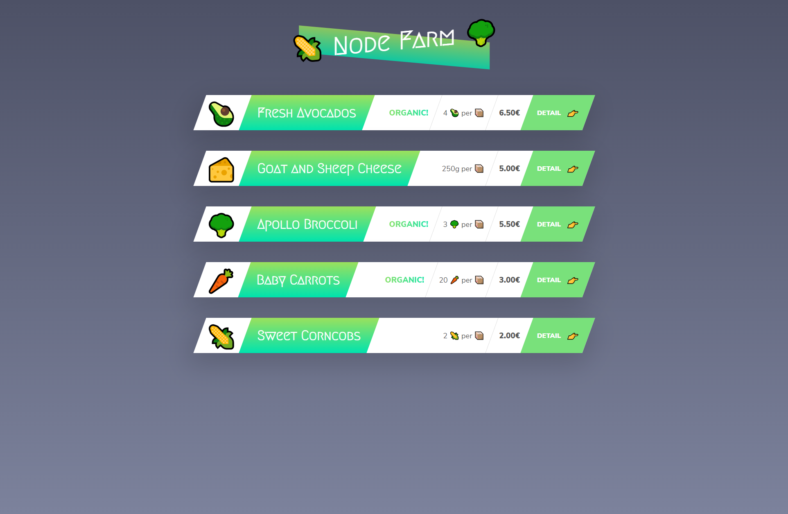
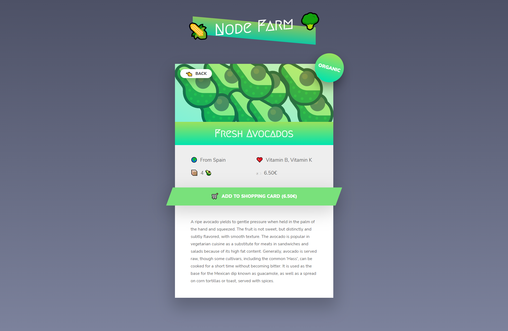

# [Node.js, Express, MongoDB & More: The Complete Bootcamp 2021](https://www.udemy.com/course/nodejs-express-mongodb-bootcamp/)
<!-- * `Purchased Course`: 31.12.2020 -->
<!-- * `Finished this Project`: 23.02.2021 16:01 -->

## Description
This small project uses `server-side rendring` with small `.json` to mimic database. Routing is emilated by using if else statments.

### Entry Point
`npm install` => `npm start` => `localhost:8000`

