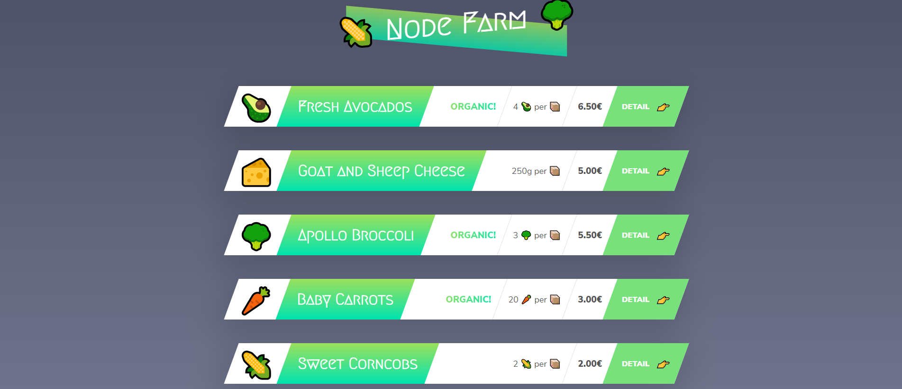
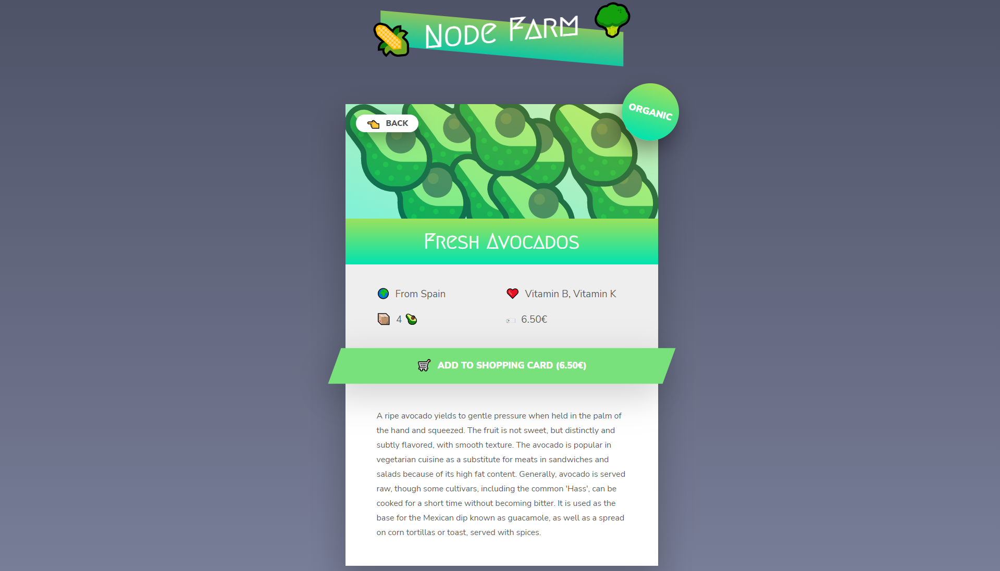

# Nodefarm
#### [Node.js, Express, MongoDB & More: The Complete Bootcamp 2021](https://www.udemy.com/course/nodejs-express-mongodb-bootcamp/)
<!-- * `Purchased Course`: 31.12.2020 -->
<!-- * `Finished this Project`: 23.02.2021 16:01 -->

## Description
Nodefarm is a simple and isolated example of using `server-side rendering`. This app employs conditional logic to emulate routing between `Home Page`, `Product Page`, and `API` that displays all data. Page rendering is achieved in routing conditional logic by replacing temple values with data from data.json file. Database is emulated using data.json file and accessed using fs(file-system) module.

## Technologies Used
* data.json - database emulation
* fs - internal module - database connection emulation
* url - internal module - accessing URL
* http - internal module - creates server
* slugify - NPM module - creates URL friendly product names
* templates - HTML files
  * template-product - home page
  * template-overview - product page
  * template-card - home page list item

## Entry Point
### Local Host
npm install => npm start => `localhost:8000`
